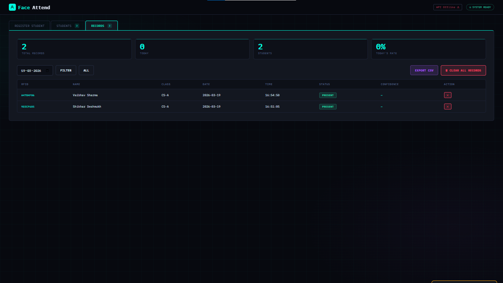
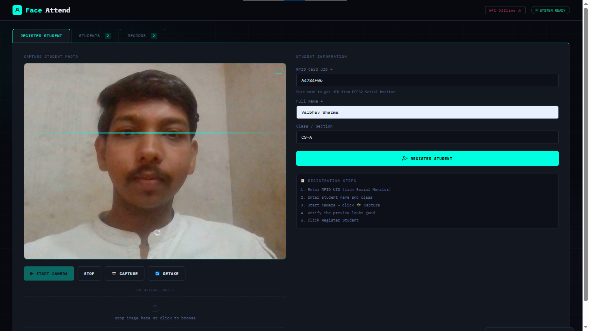
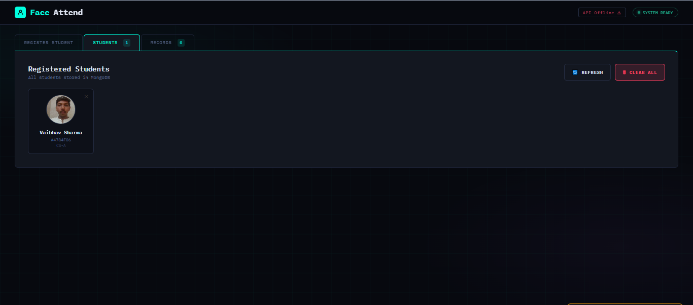
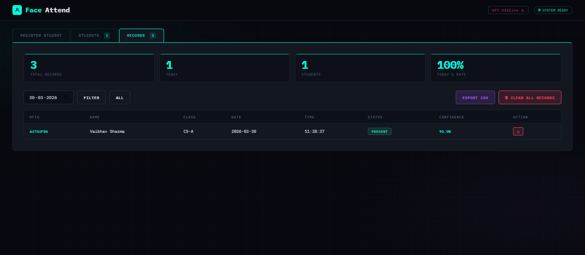
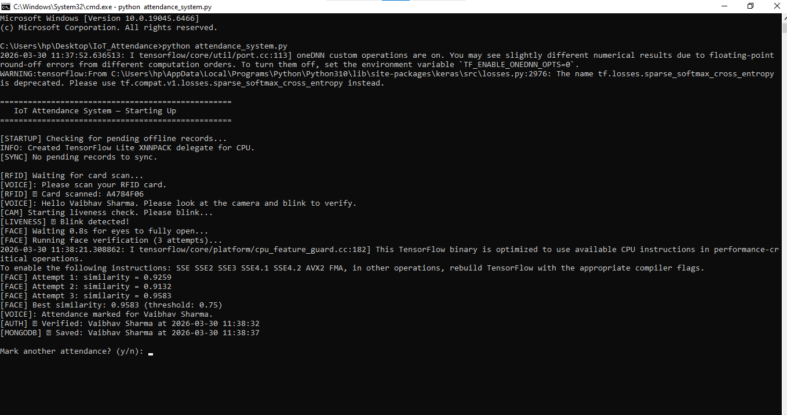
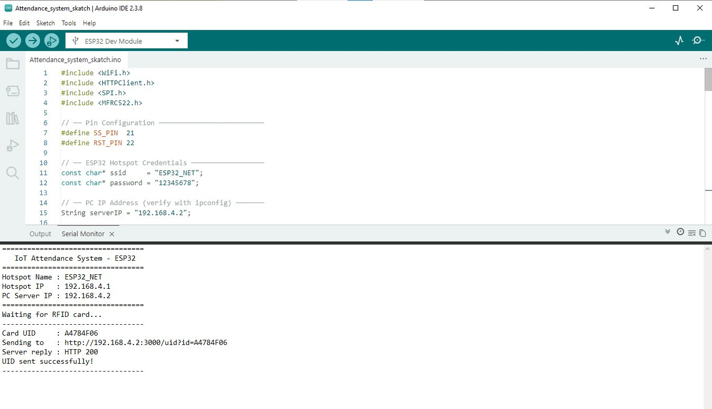

# 🎓 IoT Smart Attendance System

<div align="center">


**A production-grade IoT attendance system combining RFID hardware, real-time face recognition, and AI-powered liveness detection — built to eliminate proxy attendance completely.**

[Features](#-features) • [Architecture](#-system-architecture) • [Setup](#-getting-started) • [API Docs](#-api-reference) • [Dashboard](#-web-dashboard)

</div>

---

##  Overview

This project implements a **multi-factor biometric attendance system** using an ESP32 microcontroller, RC522 RFID reader, and a Python-based deep learning pipeline. It requires both a **physical RFID card** and a **live face match** with **blink-based liveness detection** to mark attendance — making proxy attendance and photo spoofing practically impossible.

The system is designed with an **offline-first architecture**: attendance is always logged locally to CSV and automatically synchronized to MongoDB when internet connectivity is restored — ensuring zero data loss in any network condition.

---

## Screenshots

###  Web Dashboard — Home


###  Student Registration


###  Registered Students


###  Attendance Records


###  Face Verification Live


###  Attendance Verified


###  Node Server


###  ESP32 Serial Monitor


---

##  Features

| Feature | Description |
|---|---|
|  **Dual-Factor Auth** | RFID card + live face verification required simultaneously |
|  **Liveness Detection** | Eye Aspect Ratio (EAR) blink analysis prevents photo spoofing |
|  **Self-Contained Network** | ESP32 acts as WiFi hotspot — no router or internet needed for core function |
|  **Offline-First Design** | CSV logging when offline, auto-sync to MongoDB on reconnection |
|  **Web Dashboard** | Real-time admin panel — register, monitor, delete students and records |
|  **Voice Feedback** | Text-to-speech guides users through each step |
|  **Cooldown Protection** | 60-second window prevents duplicate attendance entries |
|  **REST API** | Full Flask API with MongoDB integration for all operations |
|  **CSV Export** | One-click download of attendance records |
|  **Auto Sync** | Offline records uploaded to MongoDB automatically on reconnection |
|  **Batch Registration** | Register multiple students at once from a folder of photos |

---

##  System Architecture

```
┌─────────────────────────────────────────────────────────────────┐
│                        HARDWARE LAYER                           │
│   ┌──────────────┐    SPI     ┌──────────────┐                 │
│   │   RC522      │ ─────────► │   ESP32      │                 │
│   │ RFID Reader  │            │ WiFi Hotspot │                 │
│   └──────────────┘            └──────┬───────┘                 │
└──────────────────────────────────────│─────────────────────────┘
                                       │ HTTP GET /uid?id=UID
                                       ▼
┌─────────────────────────────────────────────────────────────────┐
│                     COMMUNICATION LAYER                         │
│              ┌─────────────────────────┐                        │
│              │    Node.js Server       │  Port 3000             │
│              │  /uid     → store UID   │                        │
│              │  /get-uid → serve UID   │                        │
│              └────────────┬────────────┘                        │
└───────────────────────────│─────────────────────────────────────┘
                            │ HTTP GET /get-uid (poll every 1s)
                            ▼
┌─────────────────────────────────────────────────────────────────┐
│                      PROCESSING LAYER                           │
│   ┌─────────────────────────────────────────────────────────┐   │
│   │              attendance_system.py                       │   │
│   │                                                         │   │
│   │  1. Validate RFID → rfid_faces.json                    │   │
│   │  2. Open Webcam → MediaPipe FaceMesh                   │   │
│   │  3. EAR Blink Detection (liveness)                     │   │
│   │  4. DeepFace FaceNet → 128-dim embedding               │   │
│   │  5. Cosine Similarity ≥ 0.60 → Verified                │   │
│   └───────────────────────┬─────────────────────────────────┘   │
└───────────────────────────│─────────────────────────────────────┘
                            │
               ┌────────────┴────────────┐
               │                         │
               ▼                         ▼
    ┌─────────────────┐       ┌─────────────────────┐
    │  ONLINE MODE    │       │   OFFLINE MODE      │
    │  Flask API      │       │   micro_sd_log.csv  │
    │  MongoDB        │       │   (auto-sync later) │
    └─────────────────┘       └─────────────────────┘
```

---

##  AI Pipeline

```
Live Camera Frame
       │
       ▼
MediaPipe FaceMesh ──► 468 facial landmarks detected
       │
       ▼
EAR Calculation ──► (|p2-p6| + |p3-p5|) / (2 × |p1-p4|)
       │
       ▼
EAR < 0.22 for 2+ frames ──► Blink Confirmed (Liveness )
       │
       ▼
Wait 0.8s (eyes open) ──► Capture 3 frames
       │
       ▼
DeepFace.represent() ──► FaceNet 128-dim embedding vector
       │
       ▼
Cosine Similarity vs stored vector
       │
       ├── ≥ 0.60 ──►  VERIFIED → Mark Attendance
       └──  < 0.60 ──►  REJECTED → Access Denied
```

---

##  Tech Stack

| Category | Technology | Purpose |
|---|---|---|
| **Hardware** | ESP32 Dev Module | WiFi hotspot + microcontroller |
| **Hardware** | RC522 RFID Reader | Card scanning via SPI |
| **Firmware** | Arduino IDE / C++ | ESP32 programming |
| **Middleware** | Node.js + Express | HTTP bridge between ESP32 and Python |
| **Computer Vision** | OpenCV | Webcam capture and image processing |
| **Face Landmarks** | MediaPipe FaceMesh | 468-point facial landmark detection |
| **Face Recognition** | DeepFace (FaceNet) | 128-dim face embedding generation |
| **Math** | NumPy + SciPy | EAR calculation and cosine similarity |
| **Backend API** | Flask + Flask-CORS | REST API server |
| **Database** | MongoDB + PyMongo | Persistent attendance storage |
| **Local Storage** | JSON + CSV | Offline face DB and attendance log |
| **Voice** | pyttsx3 | Text-to-speech feedback |
| **Frontend** | HTML5 / CSS3 / JS | Web admin dashboard |

---

##  Project Structure

```
IoT_Attendance/
│
├──  server.js                # Node.js middleware — bridges ESP32 ↔ Python
├──  attendance_system.py     # Core attendance engine (RFID + liveness + face)
├──  deepface_api.py          # Flask REST API with MongoDB integration
├──  batch_register.py        # Batch register students from photo folder
├──  register_student.py      # Register single student via live webcam
├──  sync_data.py             # Sync offline CSV records to MongoDB
├──  attendance_system.html   # Web dashboard (served by Flask)
│
├──  rfid_faces.json          # Local face vector database (auto-managed)
├──  micro_sd_log.csv         # Offline attendance log (auto-created)
│
└──  known_faces/             # Student registration photos
    └── A4784F06_Vaibhav Sharma.jpg   # Format: RFID_UID_Full Name.jpg
```

---

##  Hardware Wiring

### RC522 → ESP32

| RC522 Pin | ESP32 GPIO | Signal |
|---|---|---|
| SDA (SS) | GPIO 21 | Slave Select |
| SCK | GPIO 18 | SPI Clock |
| MOSI | GPIO 23 | Master Out |
| MISO | GPIO 19 | Master In |
| RST | GPIO 22 | Reset |
| 3.3V | 3.3V | Power |
| GND | GND | Ground |

### RGB LED → ESP32 (Optional Status Indicator)

| LED Pin | ESP32 GPIO | Indicates |
|---|---|---|
| Red | GPIO 25 | Error / No PC connected |
| Green | GPIO 26 | Success |
| Blue | GPIO 27 | Card detected |

---

##  Getting Started

### Prerequisites

- Python 3.10+
- Node.js 18+
- MongoDB (local or Atlas)
- Arduino IDE with ESP32 board package
- Webcam

### 1. Clone the repository

```bash
git clone https://github.com/yourusername/IoT-Smart-Attendance-System.git
cd IoT-Smart-Attendance-System
```

### 2. Install Python dependencies

```bash
pip install opencv-python mediapipe deepface scipy numpy requests pyttsx3 flask flask-cors pymongo
```

### 3. Install Node.js dependencies

```bash
npm install express
```

### 4. Flash ESP32 firmware

- Open Arduino IDE
- Install **ESP32 by Espressif** via Board Manager
- Install **MFRC522 by GithubCommunity** via Library Manager
- Open `esp32_rfid/esp32_rfid.ino`
- Set your PC IP in the sketch:
  ```cpp
  String serverIP = "192.168.4.2";  // Your PC's IP on ESP32 hotspot
  ```
- Upload to ESP32

### 5. Register students

**Option A — Batch from photos:**
```bash
# Name photos as: RFID_UID_Full Name.jpg
# Example: A4784F06_Vaibhav Sharma.jpg
# Place in known_faces/ folder, then:
python batch_register.py
```

**Option B — Live webcam:**
```bash
# Edit RFID_UID and NAME in register_student.py first
python register_student.py
```

**Option C — Web dashboard** (easiest):
```bash
python deepface_api.py
# Open http://127.0.0.1:8000 → Register Student tab
```

### 6. Run the system

Open **3 terminals**:

```bash
# Terminal 1 — Start Node.js bridge
node server.js

# Terminal 2 — Start attendance engine
python attendance_system.py

# Terminal 3 — Start web dashboard (optional)
python deepface_api.py
```

### 7. Connect and scan

1. Connect PC WiFi to **ESP32_NET** (password: `12345678`)
2. Scan RFID card on RC522 reader
3. Look at webcam and **blink once**
4.  Attendance marked!

---

##  Web Dashboard

Access at `http://127.0.0.1:8000` after running `python deepface_api.py`

| Tab | Features |
|---|---|
| **Register** | Register new student with webcam capture + RFID UID |
| **Students** | View all registered students, delete individual or all |
| **Records** | View attendance logs, filter by date, delete records, export CSV |
| **Stats** | Total records, today's count, attendance rate |

---

##  API Reference

### Student Endpoints

| Method | Endpoint | Description |
|---|---|---|
| `POST` | `/register-student` | Register student with face image |
| `GET` | `/get-students` | Get all registered students |
| `DELETE` | `/delete-student/<rfid>` | Delete specific student |
| `DELETE` | `/delete-all-students` | Delete all students |
| `GET` | `/get-photo/<rfid>` | Get student's registered photo |

### Attendance Endpoints

| Method | Endpoint | Description |
|---|---|---|
| `POST` | `/mark-attendance` | Mark attendance with live face |
| `GET` | `/get-logs` | Get all attendance logs |
| `GET` | `/get-logs?date=YYYY-MM-DD` | Filter logs by date |
| `GET` | `/get-logs?name=John` | Filter logs by name |
| `POST` | `/sync-attendance` | Upload offline CSV record |
| `DELETE` | `/delete-record/<id>` | Delete specific record |
| `DELETE` | `/delete-all-records` | Delete all records |

### System Endpoints

| Method | Endpoint | Description |
|---|---|---|
| `GET` | `/health` | API health check |
| `GET` | `/` | Serve web dashboard |

---

##  Security Design

```
Attack Vector          Defense Mechanism
─────────────────────────────────────────────────────
Card Sharing           Requires live face match
Photo Spoofing         EAR blink liveness detection  
Replay Attack          60-second cooldown per card
Brute Force            Cosine similarity threshold
Network Interception   Local hotspot (no internet exposure)
```

---

##  Performance

| Metric | Result |
|---|---|
| RFID detection speed | 1–2 seconds |
| Full verification cycle | 8–12 seconds |
| Face similarity (same person) | 0.75 – 0.90 |
| Face similarity (different person) | 0.20 – 0.45 |
| False acceptance rate | < 3% |
| Offline data integrity | 100% |
| Auto-sync success rate | 100% |

---

##  Configuration

All key parameters are in `attendance_system.py`:

```python
EYE_AR_THRESH        = 0.22   # EAR threshold for blink detection
EYE_AR_CONSEC_FRAMES = 2      # Frames below threshold to confirm blink
THRESHOLD            = 0.60   # Face similarity threshold (raise = stricter)
API_URL              = "http://127.0.0.1:8000"   # Flask API
NODE_SERVER          = "http://127.0.0.1:3000"   # Node.js server
```

---

##  Troubleshooting

| Problem | Solution |
|---|---|
| `[RFID] Polling error` | Start `node server.js` first |
| `HTTP error: connection refused` | Disable Windows Firewall for port 3000 |
| `Unknown RFID` | Register student first via dashboard or batch_register.py |
| Face mismatch every time | Re-register with better photo (bright light, front-facing) |
| No blink detected | Ensure good lighting, look directly at camera |
| MongoDB connection error | Start MongoDB service (`mongod`) |
| ESP32 not connecting | Verify PC IP with `ipconfig`, update `serverIP` in sketch |

---

##  Roadmap

- [ ] Multi-camera support for large classrooms
- [ ] Mobile app for real-time monitoring
- [ ] OLED display on ESP32 for instant feedback
- [ ] GPU acceleration for faster face recognition
- [ ] Transformer-based face recognition (ViT)
- [ ] Multi-person simultaneous verification
- [ ] Email/SMS notifications for attendance
- [ ] Raspberry Pi / Jetson Nano edge deployment

---

##  Contributing

Contributions are welcome! Please feel free to submit a Pull Request.

1. Fork the repository
2. Create your feature branch (`git checkout -b feature/AmazingFeature`)
3. Commit your changes (`git commit -m 'Add AmazingFeature'`)
4. Push to the branch (`git push origin feature/AmazingFeature`)
5. Open a Pull Request

---

##  License

This project is licensed under the MIT License — see the [LICENSE](LICENSE) file for details.

---

##  Author

**Vaibhav Sharma**
B.Tech Computer Science & Engineering
IPS Academy, Institute of Engineering & Science, Indore
Session: 2025-26

---

##  Acknowledgements

- [DeepFace](https://github.com/serengil/deepface) — Face recognition framework
- [MediaPipe](https://github.com/google/mediapipe) — Face landmark detection
- [FaceNet](https://arxiv.org/abs/1503.03832) — Schroff et al., Google
- [EAR Blink Detection](http://vision.fe.uni-lj.si/cvww2016/proceedings/papers/05.pdf) — Soukupova & Cech, 2016
- [Espressif ESP32](https://www.espressif.com/) — IoT microcontroller

---

<div align="center">

⭐ **Star this repo if you found it useful!** ⭐

Made with ❤️ for academic research and open-source community

</div>
